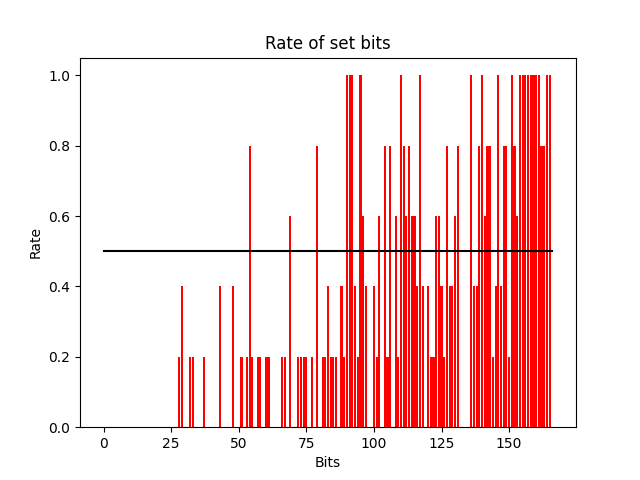
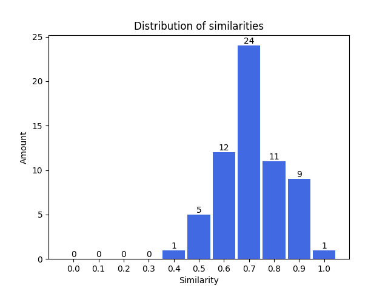
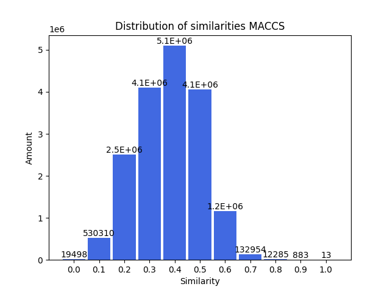
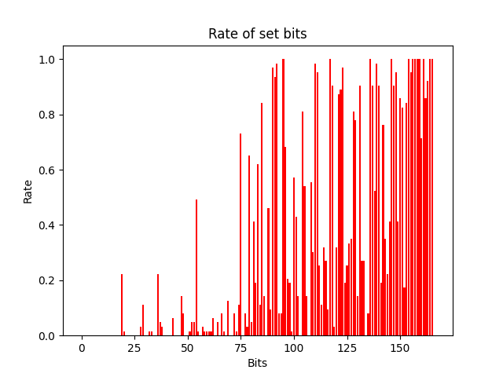

# Construction of query fingerprints using synthetic minority over-sampling techniques by combining information from active and inactive compounds

This serves as an overview for the demo program created to execute the neccesary tasks explained in the corresponding work.
It is fully usable via command line, depending on the set flags it executes different types of tasks. A list of possible
flags and examples will be given below in the manual section.

Generally, this program is trying to find similar molecules guided by the knowledge of active and inactive substances
for a specific target. If provided with separate files for active and inactive compounds, containing information about
their names together with their corresponding SMILES representation, a combined fingerprint can be generated.
This combined fingerprint can then be compared to the substances in a seperate database and the 10 entries with the highest similarity scores are determined. Those results can then be used to conduct different kinds of visual and statistical evaluations.


## Setup

The program is written in Python 3.10. Additional information on needed modules can be found in the requirements.txt
file, which lists all used external libraries and their specific version number. An installation of MySQL is to be preferred. The program can create a local copy of the current SureChEMBL data entries on PubChem using its FTP server and writing everything into a MySQL database. However, this is not necessary for using the basic functionalities of the program and takes up multiple hours to complete.

Some program variables must be set to different values for the MySQL database to work as needed for this program. This includes:

* innodb_lock_wait_timeout
* wait_timeout
* log_bin
* binlog_expire_logs_secods

The loading of the data into the corresponding tables takes quite some time, such that **innodb_lock_wait_timeout** and **wait_timeout** should be set to their maximum values. Additionally, all kinds of logging should be observed beforehand, since those files can fill up a lot of disk space rather fast.


## Manual
As stated, before the whole program is usable via command line, the following list shows all possible flags the program
is capable of recognizing. Flags sharing a line mean that they take care of the same task, this was done as means to have a short version that is faster to write and a long version with a more telling name.
<br />
* --help,   &emsp;&emsp;&emsp;&emsp;&emsp;&nbsp; -h
* --fingerprints, &emsp;&emsp;&nbsp; -f
* --distances,    &emsp;&emsp;&emsp; -d
* --ranks, &emsp;&emsp;&emsp;&emsp;&ensp;&nbsp;&nbsp; -r
* --combine, &emsp;&emsp;&emsp;&nbsp;&nbsp; -c
* --statistic, &emsp;&emsp;&emsp;&ensp;&nbsp;&nbsp; -s
* --matching, &emsp;&emsp;&emsp; -m
* --compare, &emsp;&emsp;&emsp;&ensp; -p
* --evaluation, &emsp;&emsp;&nbsp;&nbsp;&nbsp; -e
* --initialize, &emsp;&emsp;&emsp;&emsp;&nbsp; -i
<br />

There exists a general help text for the whole program which is displayed when executing the program with the `-h` or
`--help` flag. Giving general information about the program and about all the different modes of action.
<br />
#### Example for execution of the help command:
```
main.py -h 
main.py --help
```
Additionally, a command specific manual for most flags exists in the help_texts folder. Those texts will also be printed into the console, if the program is run with a flag without its required input arguments.
<br />
#### Example for getting command specific help texts:
```
main.py -d
```
**NOTE:** Usually the distances command would expect 3 additional input arguments after its flag. In this case nothing besides the flag
is provided. Which is why the help text would be displayed.


## Example usage of program

### Introduction
___

The following will show an exemplary rundown of the program, showing the format of input and output files as well. Similar
information can be found in the specific help texts for all the commands. However, those contain more specific information, 
while this serves as a simpler, more practical overview.

Within the program files we have a directory called `datasets` and a directory called `output`. We are going to use the
datasets directory to store our initial example data and the output directory as the destination folder for all generated output. First, we need to put the data we want to work with in the datasets directory, having two separate files. One of them containing the active compounds and the other one the inactive compounds towards a specific target. 

#### Example tree structure of datasets directory:

```bash
.
└───datasets
    ├── actives.txt
    └── inactives.txt.     
```
For each compound in those files the SMILES representation and a corresponding identifier is sufficient. Where the SMILES
needs to be in the first column and the identifier in the second column, such that each line represents one substance.
Information in additional columns will be ignored.

#### Example contents of actives.txt:

```
C[C@H](N[C@@H](CCC1=CC=CC=C1)C(O)=O)C(=O)N2CCC[C@H]2C(O)=O	enalaprilat
C[C@H](CS)C(=O)N1CCC[C@H]1C(O)=O	captopril
```


### Preparation for combining fingerprints
___

This is all we need to start generating the fingerprints for all compounds in the actives.txt and inactives.txt files. We can choose from five different types of fingerprints, which are all implemented in the **RDKit library**.
We can choose from the following fingerprint types:

* MACCS
* Morgan
* Atom Pairs
* Topological Torsion
* 2D Pharmacophore
<br />

To generate MACCS fingerprints for the actives.txt and inactives.file in the datasets directory. We can use the following command line statement to store the results in the output folder. The generated files will contain the original data found in the input file, as well as a serialized byte representation of the created fingerprints.

#### Example generation of fingerprints for actives.txt and inactives.txt:

```
main.py -f datasets/actives.txt output/actives_fingerprints.asc MACCS
main.py -f datasets/inactives.txt output/inactives_fingerprints.asc MACCS
```

After we have generated the fingerprints we need, we can use them to calculate the Manhattan distances between the active and inactive compounds. The ranking is not done immediately, such that we are able to check the calculated values more easily. The results will be sorted in a way that entries concerning one active will be grouped together.

#### Example calculation of Manhattan distances between actives and inactives:

```
main.py -d output/actives_fingerprints.asc output/inactives_fingerprints.asc output/distances.asc
```

The data we receive can then be used to create a ranking of the active compounds, based on the sum of their Manhattan distances. The standard ranking is in descending order. However, it is possible to change the ranking order to ascending order by giving the additional `invert` argument.

#### Example creation of ranking for active compounds:
```
main.py -r output/distances.asc output/ranks.asc
main.py -r output/distances.asc output/ranks_inv.asc invert
```

All those previous commands will create output files that contain the data we need to perform our first combining process. The output directory will now contain the following files:

```bash
.
└───output
    ├── actives_fingerprints.asc
    ├── distances.asc
    ├── inactives_fingerprints.asc
    ├── ranks.asc
    └── ranks_inv.asc   
```


### Combining of fingerprints
___

Using the data we received via the previous steps, we are now able to perform the combination of fingerprints. This process can be influenced by multiple input arguments. 

We can choose between two different selection modes for the fingerprints to be used in combining. Using the `Top` mode the compounds that can be found at the top of the ranking will be used for the combining process. Alternatively, when using the `Nearest` mode the top-ranking compound and its nearest-neighbors will be used in the creation for the combining process. Additionally, the amount of fingerprints to be used can be set by giving an integer number.
Like this one can use the Top5 or 10-nearest-neighbors as a fingerprint set on which the combined fingerprint will be based on. Finally, the threshold at which rate a bit should be set to 1 can also be changed by giving an additional float number between 0 and 1. The default value is set to 0.5.

#### Example creation of combined fingerprints:
```
main.py -c output/ranks.asc output/actives_fingerprints.asc output/combined_top5.asc Top 5
main.py -c output/ranks.asc output/actives_fingerprints.asc output/combined_nearest10.asc Nearest 10
```
The base output files we receive will contain information about the combination process. Like the ranking of the chosen compounds together with their names, the used fingerprint type as well as a serialized byte object of the generated combined fingerprint. However, there are some additional files that will be generated. One of them contains the ranking with the corresponding names, followed by detailed information about the rate with wich each individual bit was set to on in the set of fingerprints used for combination (combined_nearest10_statistic.asc). Additionally, a visual representation of that data will be created as a bar chart (combined_nearest10_statistic.png). 

#### Files found in output directory:

```bash
.
└───output
    ├── actives_fingerprints.asc
    ├── combined_nearest10.asc
    ├── combined_nearest10_statistic.asc
    ├── combined_nearest10_statistic.png
    ├── combined_top5.asc
    ├── combined_top5_statistic.asc
    ├── combined_top5_statistic.png
    ├── distances.asc
    ├── inactives_fingerprints.asc
    ├── ranks.asc
    └── ranks_inv.asc
```
#### Example visual representation of bit rates:
The red bars represent the rate with which each specific bit was set to 1 in the used fingerprint set for combination. The black horizontal line represents the chosen threshold at which bits were set to 1 in the combined fingerprint. This file was taken from a combination process using the top 5 compounds from a set of actives.



The data found in the combined fingerprint file, can then be used to perform similarity searches on different databases. Per default the program will try to
connect to a local MySQL database that can be initialized using the initialize command. Alternatively, one can also
use a file containing a set of custom compounds. Depending on the size of that file and chosen fingerprint type this process may take some time. This file 
simply needs to be given as an additional argument when writing the matching statement. Additionally, this file needs to be of the same format as the ones used for fingerprint generation or it needs to be a fingerprint file, which saves the time used for generating all the fingerprints. Regardless of the used database a file with the added suffix **all_scores.asc** will record all calculated similarity scores during the screening process, which can later be used to analyze overall similarity score distributions.

#### Example similarity search:

```
main.py -m output/combined_top5.asc output/matches_top5.asc
main.py -m output/combined_top5.asc output/matches_top5.asc datasets/compounds.txt
```


### Statistical and visual evaluation of results
___

The resulting compounds with the highest similarity scores can then be evaluated using the program on a basic visual and statistical level.
It is possible to calculate the average similarity scores between a resulting matching file and any generated fingerprint file. If we want to see whether our resulting compounds are more similar to one group than another, we can calculate the similarity scores of all compounds to the top ranked ones as follows:

```
main.py -p output/matches_top5.asc output/actives_fingerprints.asc output/compare_top5_actives.asc 
main.py -p output/matches_top5.asc output/inactives_fingerprints.asc output/compare_top5_inactives.asc
```

We can then use this data to create a visual representation of the similarity distribution and perform a Mann-Whitney-U test on two given compare files. This is used to validate whether the similarities of the first group tend to be higher than the second group. The file that is expected to have the higher similarity scores should be provided first.

#### Example evaluation of compare results:

```
main.py -e output/compare_top5_actives.asc output/compare_top5_inactives.asc output/evaluation_top5.asc
```

This will generate a file containing the information about what files have been used in the Mann-Whitney-U test as well as the resulting p-value of the test. It will also state whether on the basis on this result the Null hypothesis can be rejected or not. Additionally, for both given files a bar chart containing the distribution of similarity scores will be generated.

#### Example visualization of similarity distributions:



#### Example evaluation all_scores file:

```
main.py -e output/matches_top5_all_scores.asc output/matches_top5_all_score.png 
```
This will create a bar chart containing all calculated similarity scores during the execution of the matching command. This can be used to validate whether there were a lot of compounds with similarities as high as the top ranking ones or not. Giving an idea on how common it is to find compounds as similar to the combined fingerprint as the found top ranking compounds. 

#### Example visualization of all_scores similarity distributions:




### Additional functionalities
___
There are some additional features the program is capable of but would have disrupted the flow of the program explanation. Which is why they are discussed here.

For every generated fingerprint file, it is possible to create a statistics file similar to the ones generated during performing a combination. Those will respect all fingerprints within the given file. The output file will contain all compounds in the same order as in the fingerprints file and the information about the rate of set bits within those fingerprints. A corresponding bar chart will also be created, but without a horizontal black line, since no threshold has been used.

#### The command line statement to do so needs to be of this form:
```
main.py -s output/actives_fingerprints.asc output/actives_statistics.asc
```
#### Example visual representation of bit rates alternative:



### Usage of result compounds
___

For every run of this process, one receives 10 compounds, that have the highest similarity to a generated combined fingerprint. How one chooses to utilize those final hits depends on the application that they are needed for. One idea is to conduct multiple runs with different fingerpint setting and evaluate whether the resulting compounds that have a high frequency of appearing are potentially interesting scaffolds for a certain target. 


